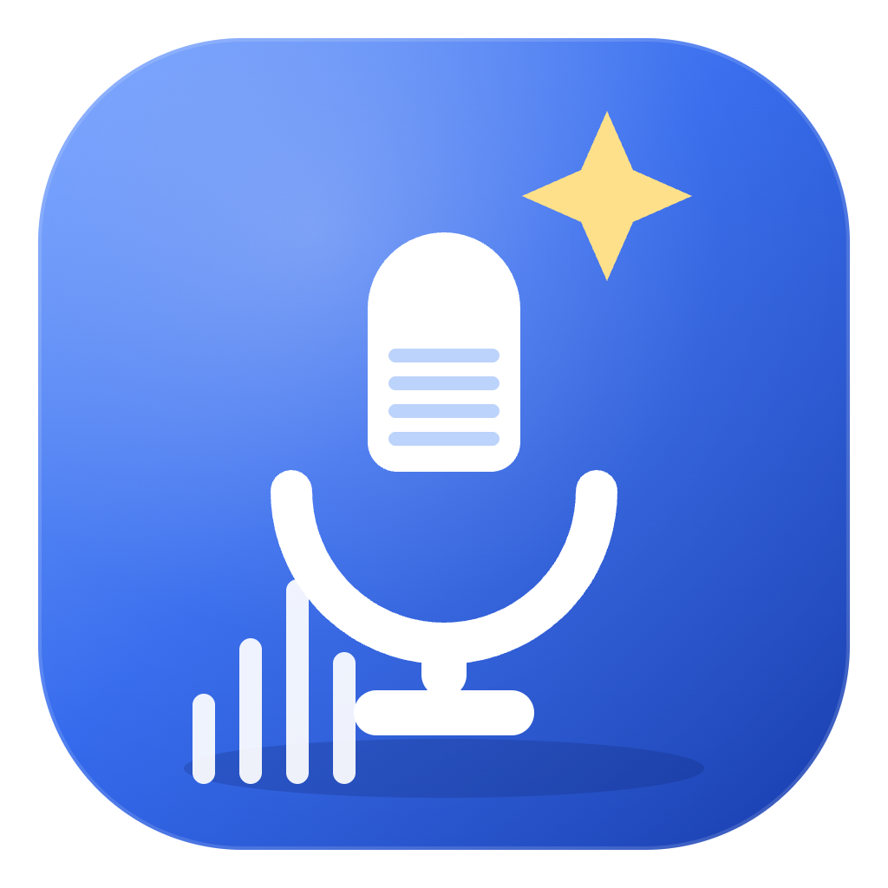

# WhisperNotes

**Local-first lecture recorder → on-device transcription → AI-organized notes.**

Record the lecture, get a live transcript from a local whisper.cpp engine (your audio never leaves the machine), then turn that transcript into clean, structured Markdown notes with a model of your choice.

**本地优先的课堂录音 → 本机转写 → AI 整理成笔记。** 录音用本机 whisper.cpp 实时转写，音频不出本机；再用你自己配置的模型把转写整理成结构化 Markdown 笔记。

<p align="center">
  
</p>

<p align="center">
  macOS (Apple Silicon) · Windows 10/11 (x64) · Apache-2.0 · Electron 44 + React 19 + whisper.cpp
</p>

---

## Contents / 目录

- [English](#english) — [What it is](#what-it-is) · [Highlights](#highlights) · [Requirements](#requirements) · [Download & install](#download--install) · [First run](#first-run) · [How it works](#how-it-works) · [Privacy](#privacy) · [Build from source](#build-from-source) · [Packaging locally](#packaging-locally-no-ci-required) · [Releasing](#releasing) · [Settings](#settings-worth-knowing) · [FAQ & troubleshooting](#faq--troubleshooting) · [Roadmap](#roadmap) · [License](#license--credits)
- [中文说明](#中文说明) — [简介](#简介) · [亮点](#亮点) · [环境要求](#环境要求) · [下载与安装](#下载与安装) · [首次运行](#首次运行) · [工作原理](#工作原理) · [隐私](#隐私) · [从源码运行](#从源码运行) · [本地打包](#本地打包不需要-ci) · [发布流程](#发布流程) · [值得注意的设置](#值得注意的设置) · [常见问题](#常见问题) · [路线图](#路线图) · [许可与致谢](#许可与致谢)

---

# English

## What it is

WhisperNotes is a study companion for anyone who sits in lectures, seminars and online classes and wishes the notes wrote themselves.

Hit record and it transcribes speech **live on your own computer** using a bundled whisper.cpp engine — no cloud, no account, no audio upload. Hit stop and it hands that transcript to the AI model you configured, which turns messy spoken lecture into clean Markdown notes: headings, definitions, key numbers, examples, action items — filed into a searchable notebook tree and exportable whenever you want.

It is deliberately narrow: transcription is local and always available, and the only thing that ever goes over the network is the **text** you ask to organize.

## Highlights

- 🎙 **Live, local transcription** — 16 kHz capture → energy-VAD segmentation → resident `whisper-server`. Sentences are finalized as you speak; you can fix the text while recording continues. GPU (Metal) accelerated on Apple Silicon, CPU on Windows.
- 🔌 **Works offline** — transcription needs no network and no API key at all. Bring a key only when you want AI notes.
- ✨ **Notes that match how you study** — templates (Study / Outline / Cornell / Key points / Custom) × length (Concise / Standard / Detailed). Long lectures are chunked, merged, and **auto-continued** when the model hits its output ceiling, so a two-hour seminar doesn't collapse into half a page.
- 📎 **Slides as ground truth** — attach a PDF/PPTX (password-protected supported): slide text guides the note generation, and the deck's terminology also improves name/acronym spelling during transcription.
- 📓 **Notes you actually own** — a local SQLite library with notebooks and sub-notebooks you can drag, reorder and nest; Markdown editor with highlights, tables and images; tags; full-text search; TOC jump; undo and draft recovery; one-click `.md` export.
- 🗂 **Transcripts you can revisit** — every recording and import is archived. Weeks later you can polish it against the slides or organize it into a note without recording anything again.
- 🔍 **Nothing hidden** — organizing runs as an inspectable background job: click the card for per-chunk progress, a live log, the exact upstream error, a retry button and a history of recent runs. Failures are diagnoses, not mysteries.
- 🌏 **Bilingual** — the whole interface (menus, errors, progress, even default note titles) ships in English and Simplified Chinese and switches instantly.

## Requirements

| | |
|---|---|
| macOS | **12+, Apple Silicon (arm64)**. Intel Macs are not covered by the prebuilt release — build from source with your own x64 engine. |
| Windows | **10 / 11, x64**. Needs the [Microsoft Visual C++ 2015–2022 Redistributable (x64)](https://aka.ms/vs/17/release/vc_redist.x64.exe) — the bundled engine's DLLs depend on it. |
| AI notes (optional) | An [OpenRouter](https://openrouter.ai/keys) API key. The default model is **free**; recording and transcription need neither a key nor a network. |
| Disk | ≈1 GB (mostly the model, downloaded on first run) |
| Build from source | Node ≥ 20. No Xcode / C++ toolchain needed — whisper.cpp binaries ship in the repo. |

## Download & install

**Option 1 — Releases.** Grab the latest build from **[Releases](../../releases/latest)**:

| Platform | File |
|---|---|
| macOS (Apple Silicon) | `WhisperNotes-<version>-arm64.dmg` (recommended) or `-arm64-mac.zip` |
| Windows (x64) | `WhisperNotes-<version>-win-x64.exe` (installer) or `-win-x64.zip` (portable) |

**Option 2 — build it yourself** (`npm run dist:mac` / `npm run dist:win`): locally built apps carry no quarantine flag, so macOS opens them without any Gatekeeper dance. See [Packaging locally](#packaging-locally-no-ci-required).

### macOS

1. Open the `.dmg` and drag **WhisperNotes** into **Applications**.
2. The release is **not notarized** (that requires a paid Apple Developer account), so Gatekeeper blocks the first launch with *“Apple could not verify…”* or *“… is damaged and can't be opened”*. Do **one** of these:

   **A — no Terminal (recommended on macOS 15+)** — try to open the app once, then go to  → **System Settings → Privacy & Security** → scroll down → **Open Anyway** next to WhisperNotes → confirm.

   **B — remove the quarantine flag (Terminal)**
   ```bash
   xattr -dr com.apple.quarantine /Applications/WhisperNotes.app
   open -a WhisperNotes
   ```

   **C — build it yourself** (no Gatekeeper prompt at all).

   > **Why is this needed?** The macOS build is *ad-hoc signed* (integrity only — no certificate, no notarization ticket), so Gatekeeper cannot verify a developer. Note that neither `codesign --sign -` nor the `com.apple.security.cs.disable-library-validation` entitlement can bypass Gatekeeper: ad-hoc signing carries no identity, and that entitlement only relaxes runtime dylib checks (it is what makes *hardened runtime + ad-hoc* stop crashing — not what makes Gatekeeper trust you). Only a **Developer ID + notarization** removes this step; the CI is already wired for it ([Releasing](#releasing)).

### Windows

1. Run `WhisperNotes-<version>-win-x64.exe` (or unzip the portable build and run `WhisperNotes.exe`).
2. If SmartScreen appears, choose **More info → Run anyway** (the build is unsigned).
3. If the engine fails to start with a missing-DLL error, install the [VC++ 2015–2022 Redistributable (x64)](https://aka.ms/vs/17/release/vc_redist.x64.exe) — the app detects this case and tells you exactly that.

## First run

1. **Model** — not bundled (keeps the download small). On first launch the app downloads the default model (`ggml-large-v3-turbo-q5_0`, ≈574 MB) from HuggingFace, selects it, and never asks again. Switching or deleting models happens in **Settings → Transcription models**; if you delete them all, the next launch downloads again automatically.
2. **Microphone** — grant permission when the system asks.
3. **AI (optional)** — paste your OpenRouter API key in **Settings → AI model** (stored encrypted with the OS keystore). Without a key you can still record, transcribe and edit notes by hand.
4. **Language** — UI language (中文/English) and recording language are separate settings.

> **Recording system audio** (online lectures) on macOS: install [BlackHole 2ch](https://existential.audio/blackhole/), create a Multi-Output Device in *Audio MIDI Setup* (speakers + BlackHole), then pick that device in **Settings → Recording device**.

## How it works

```
mic / audio file
   │ 16 kHz PCM
   ├─► VAD segmentation ─► resident whisper-server (local whisper.cpp) ─► live transcript
   │                                                                        │
   └─► optional slide text (PDF/PPTX) ───────────────────────────────────────┤
                                                                            ▼
                                     chat completions (OpenRouter-compatible) ─► chunks ─► merge
                                                                            ▼
                                                          SQLite notes library + Markdown editor
```

- **Shell**: Electron 44 + React 19 + TypeScript + Tailwind v4 (electron-vite build, electron-builder packaging).
- **ASR**: a resident `whisper-server` child process — `native/mac` is a Metal-enabled build, `native/win` a CPU build — driven over local HTTP. The engine is behind an `AsrEngine` interface, so other backends can be added without touching the app layer.
- **LLM**: plain `fetch` against any OpenRouter-compatible chat-completions endpoint; keys are encrypted via Electron `safeStorage` (Keychain on macOS, DPAPI on Windows).
- **Storage**: SQLite (`library.db`) plus JSON config in your own storage folder; logs for every engine start and organizing job.

## Privacy

- **Audio never leaves your machine** — transcription is 100 % local, and works with Wi-Fi off.
- **Only** “Organize into a note” and “Polish transcript” send *text* to the endpoint you configured. Nothing else talks to the network (besides the one-time model download and, if you enable it, the update check).
- API keys are encrypted with the OS keystore; notes, recordings and the database live in your own folder (configurable in Settings).
- No telemetry, no analytics, no account, no server of ours in the loop.

## Build from source

```bash
git clone https://github.com/<you>/whisper-notes.git
cd whisper-notes
npm ci            # installs deps (better-sqlite3 ships N-API prebuilds — no native rebuild needed)
npm run dev       # dev mode with HMR
```

```bash
npm run typecheck   # tsc (main/preload + renderer)
npm run build       # build out/
npm run smoke       # headless smoke test (database + engine probe)
```

whisper.cpp binaries are **already in the repo** (`native/mac`, `native/win`), so no Xcode and no C++ toolchain are required. To rebuild the engine yourself (for example a Metal build, or an x64 engine for Intel Macs):

```bash
git clone https://github.com/ggml-org/whisper.cpp && cd whisper.cpp
cmake -B build -DCMAKE_BUILD_TYPE=Release -DGGML_METAL=ON -DGGML_METAL_EMBED_LIBRARY=ON -DBUILD_SHARED_LIBS=ON -DWHISPER_BUILD_SERVER=ON
cmake --build build -j
# copy build/bin/whisper-server + libwhisper/libggml*.dylib into native/mac/{bin,lib}
```

`GGML_METAL_EMBED_LIBRARY=ON` embeds the Metal kernels as source, so **no Xcode / `xcrun metal` is needed** — the shaders compile once at runtime and are then cached by macOS.

## Packaging locally (no CI required)

```bash
npm run dist:mac       # -> release/WhisperNotes-<v>-arm64.dmg + -arm64-mac.zip   (macOS host)
npm run dist:win       # -> release/WhisperNotes-<v>-win-x64.exe + -win-x64.zip  (runs on macOS too)
npm run dist:win:full  # same, but fetches the Windows ffmpeg.exe first
```

A Windows package **can be produced on macOS**: `better-sqlite3` v13 is N-API (ABI-stable) and the npm package already ships `prebuilds/win32-x64.node`, so no native recompilation is needed (`npmRebuild: false` in `electron-builder.yml`). electron-builder 26 edits the `.exe` metadata with a pure-JS tool, so **no Wine is required** either.

> `native/win/bin/ffmpeg.exe` is **not stored in the repo** (≈83–139 MB, close to GitHub's 100 MB per-file limit). `npm run fetch:win-ffmpeg` downloads it into place; the CI does the same before packaging Windows.

## Releasing

CI is **optional** — you can publish by uploading the files from [Packaging locally](#packaging-locally-no-ci-required). If you do want automation, `.github/workflows/release.yml` builds both platforms and attaches them to a GitHub Release:

| Job | Runner | Output |
|---|---|---|
| `windows` | `windows-latest` | NSIS installer + portable zip (x64, CPU engine) |
| `macos` | `macos-14` | DMG + zip (arm64, Metal engine) |
| `release` | tags only | GitHub Release with every artifact |

```bash
# bump "version" in package.json, then:
git commit -am "release: 0.1.4"
git tag v0.1.4
git push origin main --tags      # CI builds and publishes
```

The workflow can also be started manually (Actions → Build & Release → Run workflow).

**Enabling macOS signing + notarization** (removes the Gatekeeper step entirely)

1. Enroll in the Apple Developer Program, create a **Developer ID Application** certificate, export it as `.p12`.
2. Add repository secrets: `MAC_CERT_P12` (base64 of the `.p12`), `MAC_CERT_PASSWORD`, `APPLE_ID`, `APPLE_APP_SPECIFIC_PASSWORD`, `APPLE_TEAM_ID`.
3. Push a tag — CI imports the certificate, signs with the hardened runtime, notarizes with `notarytool` and staples the ticket (`scripts/notarize.sh` does the same locally).

Without those secrets CI falls back to **ad-hoc deep signing** (`scripts/sign-adhoc.sh`), which is why the Gatekeeper workaround above exists.

## Settings worth knowing

| Setting | Why it matters |
|---|---|
| **Use GPU (Metal)** (macOS) | On by default; off forces CPU (`-ng`). Applies on the next recording/import. Windows builds are CPU-only. |
| **Max output tokens per request** | 8k / 16k / **32k** / 64k. Bigger = longer notes, slower requests. If the model still truncates, the chunk is auto-continued; if it still doesn't fit, the note gets a ⚠️ line and the job is flagged. |
| **Max chunk size (chars)** | How much transcript goes into one request (long text is split, then merged). |
| **Note length** | Shapes the prompt. *Detailed* asks the model to keep every fact (no compression) — pair it with a larger output budget. |
| **Threads** | CPU threads for the engine; barely matters when running on the GPU. |

**Want longer, more complete notes?** Use *Detailed* + 32k (or 64k) and attach the slides if you have them. Example from a real 84 k-character lecture transcript: default settings produced a truncated ≈21 k-character note, while *Detailed + 32k* produced a complete ≈37.5 k-character note.

## FAQ & troubleshooting

**Does it work without an API key / without internet?** Yes — recording, transcription, the transcript library, the notes editor and notebooks are fully local. Only AI organizing needs a configured endpoint.

**Where is my data?** The app data folder (`~/Library/Application Support/WhisperNotes` on macOS, `%APPDATA%\WhisperNotes` on Windows) unless you point Settings → Storage somewhere else. `library.db` is the notes database, `models/` the whisper models, `logs/` the engine and organizing logs.

**Why is the model downloaded at first run?** So the installer stays ~160 MB instead of ~700 MB. It is a one-time download.

**How do I get longer notes?** Raise *Max output tokens*, choose *Detailed*, and attach slides. Truncated output is marked and can be retried.

| Symptom | Fix |
|---|---|
| macOS: *“WhisperNotes is damaged”* | `xattr -dr com.apple.quarantine /Applications/WhisperNotes.app`, or System Settings → Privacy & Security → *Open Anyway*. |
| Windows: engine won't start, missing DLL | Install the VC++ 2015–2022 Redistributable (x64) — the app shows a dedicated hint for exactly this. |
| Windows: SmartScreen warning | *More info → Run anyway* (the build is unsigned). |
| Engine start timeout | Check **Settings → Transcription engine** (status/probe) and the logs under the app data folder. |
| “Provider returned error (HTTP 400)” | The upstream provider rejected an oversized request; the app automatically retries that chunk with a smaller budget. If it persists, lower *Max output tokens*. |
| Daily limit message | The free OpenRouter tier has a per-day request cap; usage is counted locally in Settings and can be reset there. |
| `better-sqlite3` ABI error after upgrading Electron | `npm run rebuild` |
| Organizing seems stuck | Open the progress card → the detail panel shows the current chunk, live log and (on failure) the raw upstream error. Copy the log if you need to report it. |

## Roadmap

- [ ] Intel Mac (x64) build of the bundled engine
- [ ] Windows arm64 package
- [ ] Re-transcribe an archived recording with a different model/language
- [ ] Global hotkey / menu-bar recorder
- [ ] Optional faster-whisper backend behind the same `AsrEngine` interface
- [ ] Per-notebook ordering & study aids (flashcards from notes)

## License & credits

Apache License 2.0 — see [LICENSE](LICENSE).

Bundled third-party components:
- [whisper.cpp](https://github.com/ggml-org/whisper.cpp) (MIT) — the transcription engine under `native/`.
- [FFmpeg](https://ffmpeg.org/) — `native/win/bin/ffmpeg.exe` (audio decoding on Windows) ships under FFmpeg's own license (LGPL/GPL depending on the build); macOS uses the system `afconvert` or a user-installed `ffmpeg`.
- Electron, React, Tailwind, better-sqlite3, pdfjs-dist and other npm dependencies under their respective licenses (see `package-lock.json`).
- Whisper models are downloaded from HuggingFace at first run under their own licenses.
- AI features call the endpoint you configure (OpenRouter by default).

---

# 中文说明

## 简介

**WhisperNotes** 是给上课的人用的笔记工具：录音 → **本机 whisper.cpp 实时转写** → 用你自己配置的模型整理成结构化 Markdown 笔记。

按下录音，它就在**你自己的电脑上**边讲边转（无云端、无账号、音频不上传）；按下停止，它把转写交给你的 AI 模型，变成标题、定义、关键数字、例子、待办俱全的干净笔记，存进可搜索的笔记本树，随时导出。

它刻意做得"窄"：转写永远本地可用，唯一会联网的东西就是**你主动要求整理的那段文本**。

## 亮点

- 🎙 **实时本地转写**——16kHz 采集 → 能量 VAD 分句 → 常驻 `whisper-server`；说话间逐句定稿，且**边录边改**不会互相干扰。Apple Silicon 走 Metal GPU，Windows 为 CPU 引擎。
- 🔌 **可完全离线**——转写不需要网络也不需要 API Key；想用 AI 整理时再配。
- ✨ **贴合你的学习方式**——模板（学习/大纲/Cornell/要点/自定义）× 长度（简洁/标准/详细）。长讲座自动分块、合并，模型写满会自动**续写**，两小时的课不会塌成半页。
- 📎 **课件当基准**——挂上 PDF/PPTX（支持加密）：课件文本指导笔记生成，术语还会进入转写提示词，人名/缩写/课程词更准。
- 📓 **笔记真正属于你**——本地 SQLite 笔记库，笔记本与子笔记本可拖拽、排序、嵌套；Markdown 编辑器支持高亮/表格/图片；标签、全文搜索、目录跳转、撤销与草稿恢复、一键导出 `.md`。
- 🗂 **转写可回炉**——每次录音/导入都归档；过几周还能对照课件精修，或直接整理成笔记，无需重新录音转写。
- 🔍 **进度看得见**——整理是后台任务：点开卡片能看到分块进度、实时日志、上游原始报错、重试按钮和最近历史。失败是"可诊断"，不是"没反应"。
- 🌏 **中英双语**——界面、报错、进度、默认标题全部双语，切换即时生效。

## 环境要求

| | |
|---|---|
| macOS | **12 以上，Apple Silicon（arm64）**。Intel Mac 需自行编译 x64 引擎。 |
| Windows | **10 / 11 x64**，需要 [VC++ 2015–2022 Redistributable (x64)](https://aka.ms/vs/17/release/vc_redist.x64.exe)（内置引擎的 DLL 依赖它）。 |
| AI 整理（可选） | 一个 [OpenRouter](https://openrouter.ai/keys) API Key（默认模型**免费**）；不配也能录音、转写、手写笔记。 |
| 磁盘 | 约 1 GB（主要是首次运行下载的模型） |
| 源码运行 | Node ≥ 20；不需要 Xcode 或 C++ 工具链（引擎二进制随仓库提供）。 |

## 下载与安装

**方式一：Releases**——到 **[Releases](../../releases/latest)** 下载：

| 平台 | 文件 |
|---|---|
| macOS（Apple Silicon） | `WhisperNotes-<版本>-arm64.dmg`（推荐）或 `-arm64-mac.zip` |
| Windows（x64） | `WhisperNotes-<版本>-win-x64.exe`（安装包）或 `-win-x64.zip`（免安装） |

**方式二：自己打包**（`npm run dist:mac` / `npm run dist:win`）——本地构建的 app 没有隔离标记，macOS 上双击即开，见[本地打包](#本地打包不需要-ci)。

### macOS 安装步骤

1. 打开 `.dmg`，把 **WhisperNotes** 拖进「应用程序」。
2. 首次打开会被 Gatekeeper 拦截（"无法验证开发者"或"已损坏，无法打开"），因为发布包**未经 Apple 公证**。任选一种：

   **方式 A（推荐，macOS 15+ 官方入口）**：先双击一次让它报错 → **系统设置 → 隐私与安全性** → 向下滚动 → 点 WhisperNotes 旁的 **"仍要打开"** → 确认。

   **方式 B（终端去掉隔离标记）**
   ```bash
   xattr -dr com.apple.quarantine /Applications/WhisperNotes.app
   open -a WhisperNotes
   ```

   **方式 C**：自己从源码打包（完全没有这个提示）。

   > **为什么必须这样**：macOS 版是 **ad-hoc 签名**（只保证完整性，没有证书、没有公证票据），Gatekeeper 无法验证开发者。注意：`codesign --sign -` 和 `com.apple.security.cs.disable-library-validation` **都无法绕过** Gatekeeper——前者没有身份，后者只是运行时放宽动态库校验（它是用来解决"ad-hoc + hardened runtime 崩溃"的，不是用来让系统信任你的）。想让人人双击即开，只有 **Developer ID 证书 + 公证**（CI 已预留，见[发布流程](#发布流程)）。

### Windows 安装步骤

1. 运行 `WhisperNotes-<版本>-win-x64.exe`（或解压免安装版运行 `WhisperNotes.exe`）。
2. SmartScreen 提示时选 **更多信息 → 仍要运行**（包未签名）。
3. 若转写启动失败并提示缺少 DLL → 安装 [VC++ 2015–2022 Redistributable (x64)](https://aka.ms/vs/17/release/vc_redist.x64.exe)（app 会专门提示这一情况）。

## 首次运行

1. **自动下载模型**：安装包不含模型（否则体积翻几倍）。首次启动自动下载 `ggml-large-v3-turbo-q5_0`（约 574 MB）并选用，之后不再打扰。可在 **设置 → 转写模型** 更换；若全部删除，下次启动会自动重新下载。
2. **麦克风权限**：按系统提示允许。
3. **AI（可选）**：**设置 → AI 模型** 填 OpenRouter API Key（用系统钥匙串加密存储）。不填也能录音、转写、手工编辑笔记。
4. **语言**：界面语言（中文/英文）与录音语言是两套独立设置。

> 录**系统声音**（网课）：macOS 装 [BlackHole 2ch](https://existential.audio/blackhole/)，在「音频 MIDI 设置」建多输出设备（扬声器 + BlackHole），再到 **设置 → 录音输入设备** 选它。

## 工作原理

```
麦克风 / 音频文件
   │ 16kHz PCM
   ├─► VAD 分句 ─► 常驻 whisper-server（本机 whisper.cpp）─► 实时转写
   │                                                          │
   └─► 可选课件文本（PDF/PPTX）────────────────────────────────┤
                                                              ▼
                              chat completions（兼容 OpenRouter）─► 分块 ─► 合并
                                                              ▼
                                               SQLite 笔记库 + Markdown 编辑器
```

- **外壳**：Electron 44 + React 19 + TypeScript + Tailwind v4（electron-vite 构建，electron-builder 打包）。
- **转写**：常驻 `whisper-server` 子进程——`native/mac` 是 Metal 版、`native/win` 是 CPU 版——通过本地 HTTP 调用；引擎抽象在 `AsrEngine` 接口后，接别的后端不影响上层。
- **AI**：对任意兼容 OpenRouter 的 chat-completions 端点发普通 `fetch`；Key 用 Electron `safeStorage` 加密（macOS 钥匙串 / Windows DPAPI）。
- **存储**：SQLite（`library.db`）+ JSON 配置，都在你自己的存储目录；引擎启动与整理任务都有日志。

## 隐私

- **音频不出本机**：转写 100% 本地完成，断网也能用。
- **只有**「整理成笔记」和「精修转写」会把你选中的**文本**发给你配置的端点（另外只有首次模型下载会联网）。
- API Key 由系统钥匙串加密；笔记、录音、数据库都在你自己的目录里（可在设置中更改）。
- 无遥测、无统计、无需账号，也没有我们自己的服务器在链路里。

## 从源码运行

```bash
git clone https://github.com/<你的用户名>/whisper-notes.git
cd whisper-notes
npm ci            # 安装依赖（better-sqlite3 自带 N-API 预编译，无需重编）
npm run dev       # 开发模式（热更新）
```

```bash
npm run typecheck   # 类型检查
npm run build       # 构建 out/
npm run smoke       # 无界面冒烟测试（数据库 + 引擎探测）
```

whisper.cpp 引擎**已随仓库提供**（`native/mac`、`native/win`），因此不需要 Xcode 或 C++ 工具链。想自己重编（例如给 Intel Mac 编 x64）：

```bash
git clone https://github.com/ggml-org/whisper.cpp && cd whisper.cpp
cmake -B build -DCMAKE_BUILD_TYPE=Release -DGGML_METAL=ON -DGGML_METAL_EMBED_LIBRARY=ON -DBUILD_SHARED_LIBS=ON -DWHISPER_BUILD_SERVER=ON
cmake --build build -j
# 把 build/bin/whisper-server 与 libwhisper/libggml*.dylib 复制到 native/mac/{bin,lib}
```

`GGML_METAL_EMBED_LIBRARY=ON` 把 Metal 着色器以源码形式嵌进二进制，**不需要装 Xcode**（运行时编译一次，之后由系统缓存）。

## 本地打包（不需要 CI）

```bash
npm run dist:mac       # → release/WhisperNotes-<版本>-arm64.dmg 与 -arm64-mac.zip（macOS 主机）
npm run dist:win       # → release/WhisperNotes-<版本>-win-x64.exe 与 -win-x64.zip（在 macOS 上也能出）
npm run dist:win:full  # 同上，但会先自动下载 Windows 版 ffmpeg.exe
```

Windows 包**可以在 macOS 上直接打出来**：`better-sqlite3` v13 是 N-API（ABI 稳定），npm 包里已自带 `prebuilds/win32-x64.node`，不需要重编原生模块（配置里 `npmRebuild: false`）；electron-builder 26 用纯 JS 工具改写 exe 元数据，**也不需要 Wine**。

> `native/win/bin/ffmpeg.exe` **不入库**（83–139 MB，接近 GitHub 单文件 100 MB 限制）。`npm run fetch:win-ffmpeg` 会把它下载到位；CI 在打包 Windows 前做同样的事。

## 发布流程

CI 是**可选**的——你也可以直接把[本地打包](#本地打包不需要-ci)出来的文件上传到 GitHub Release。想要自动化的话，`.github/workflows/release.yml` 会同时构建两个平台并附到 Release：

| 任务 | 运行器 | 产物 |
|---|---|---|
| `windows` | `windows-latest` | NSIS 安装包 + 免安装 zip（x64，CPU 引擎） |
| `macos` | `macos-14` | DMG + zip（arm64，Metal 引擎） |
| `release` | 仅打 tag 时 | 汇总产物并创建 GitHub Release |

```bash
# 先改 package.json 里的 version，然后
git commit -am "release: 0.1.4"
git tag v0.1.4
git push origin main --tags      # CI 自动构建并发布
```

也可在 Actions 页面手动触发（Actions → Build & Release → Run workflow）。

**启用正式签名 + 公证**（让用户双击即可打开）：

1. 加入 Apple Developer Program，创建 **Developer ID Application** 证书并导出 `.p12`。
2. 仓库 Secrets 添加：`MAC_CERT_P12`（p12 的 base64）、`MAC_CERT_PASSWORD`、`APPLE_ID`、`APPLE_APP_SPECIFIC_PASSWORD`、`APPLE_TEAM_ID`。
3. 推 tag 即可：CI 自动导入证书 → hardened runtime 签名 → `notarytool` 公证 → staple（本地也可用 `scripts/notarize.sh`）。

没有这些 secrets 时 CI 退回 **ad-hoc 深签名**（`scripts/sign-adhoc.sh`），这就是上面 macOS 需要手动放行的原因。

## 值得注意的设置

| 设置 | 说明 |
|---|---|
| **使用 GPU（Metal）**（macOS） | 默认开；关掉传 `-ng` 强制 CPU。下次开始录音/导入生效。Windows 版为纯 CPU。 |
| **单次输出上限（tokens）** | 8k / 16k / **32k** / 64k。越大笔记越长、越慢；写满会自动续写，仍不够会在笔记顶部标 ⚠️ 并把任务标记为"内容触顶"。 |
| **单块文本上限（字符）** | 每个请求的转写量；超长自动分块再合并。 |
| **笔记长度** | 影响提示词；"详细"要求尽量不压缩，建议搭配更大的输出上限。 |
| **线程数** | 引擎的 CPU 线程数；走 GPU 时几乎无影响。 |

**想要更长更完整的笔记？** 选「详细」+ 32k（或 64k），有课件就挂上。实测同一份 84k 字符的讲座转写：默认设置得到约 21k 字符且**结尾被截断**的笔记；「详细 + 32k」得到约 **37.5k 字符、完整收尾**的笔记。

## 常见问题

**没有 API Key / 没有网络能用吗？** 能。录音、转写、转写库、笔记编辑器、笔记本管理全部本地；只有 AI 整理需要配置端点。

**我的数据在哪？** 应用数据目录（macOS：`~/Library/Application Support/WhisperNotes`；Windows：`%APPDATA%\WhisperNotes`），可在设置里改到别处。`library.db` 是笔记库，`models/` 是模型，`logs/` 是引擎与整理日志。

**为什么模型要首次下载？** 这样安装包只有约 160 MB 而不是 700 MB；只需下载一次。

**怎么让笔记更长？** 调大「单次输出上限」、选「详细」档、挂上课件；被截断的输出会明确标注并可重试。

| 现象 | 处理 |
|---|---|
| macOS 提示"已损坏，无法打开" | `xattr -dr com.apple.quarantine /Applications/WhisperNotes.app`，或 系统设置 → 隐私与安全性 → "仍要打开"。 |
| Windows 引擎起不来、缺 DLL | 装 VC++ 2015–2022 Redistributable (x64)；app 会专门提示这种情况。 |
| Windows 出现 SmartScreen 警告 | 更多信息 → 仍要运行（包未签名）。 |
| `whisper-server 启动超时` | 检查 **设置 → 转写引擎** 的状态/路径；日志在应用数据目录的 `logs/`。 |
| “Provider returned error (HTTP 400)” | 上游拒绝了过大的请求；app 会自动用更小的预算重试该块。持续出现就调低单次输出上限。 |
| 提示每日额度用尽 | OpenRouter 免费档每日请求上限，本地计数（设置页可查看/重置）。 |
| 升级 Electron 后 `better-sqlite3` ABI 报错 | `npm run rebuild` |
| 整理像卡住了 | 点开右下角进度卡片 → 详情面板能看到当前块、实时日志，失败时还有上游原始错误；需要反馈时点「复制日志」。 |

## 路线图

- [ ] Intel Mac（x64）引擎构建
- [ ] Windows arm64 安装包
- [ ] 已存录音换模型/语言重新转写
- [ ] 全局快捷键 / 菜单栏常驻录音
- [ ] 在同一 `AsrEngine` 接口下接入 faster-whisper
- [ ] 笔记本内排序与学习辅助（由笔记生成抽认卡）

## 许可与致谢

Apache License 2.0，见 [LICENSE](LICENSE)。

内置第三方组件：
- [whisper.cpp](https://github.com/ggml-org/whisper.cpp)（MIT）——`native/` 下的转写引擎。
- [FFmpeg](https://ffmpeg.org/)——Windows 版 `native/win/bin/ffmpeg.exe` 用于音频解码，遵循其自身许可（LGPL/GPL，取决于构建）；macOS 使用系统 `afconvert` 或你自行安装的 `ffmpeg`。
- Electron、React、Tailwind、better-sqlite3、pdfjs-dist 等 npm 依赖遵循各自许可（见 `package-lock.json`）。
- Whisper 模型首次运行时从 HuggingFace 下载，遵循各自许可。
- AI 功能调用你配置的端点（默认 OpenRouter）。

## Developer's notes + Support

This is a project that is done completely by me with Deepseek API, and of course, is fully paid by myself. This app aims to help students like me to drop down notes in a way easier way and is completely free of charge, thats why its not notarized (im just a student...).
Hope this can help you all with your studies. This project costs me around 10$usd for development, if it's useful to you and you'd like to help cover that, you can leave a small one-time donation here: [Donate by PayPal](https://paypal.me/TNed132). No pressure—using, starring, or reporting bugs is already a big help.
